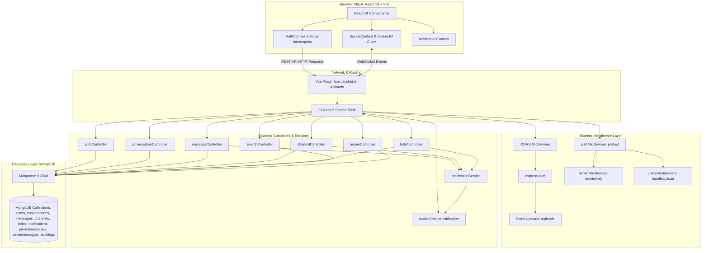
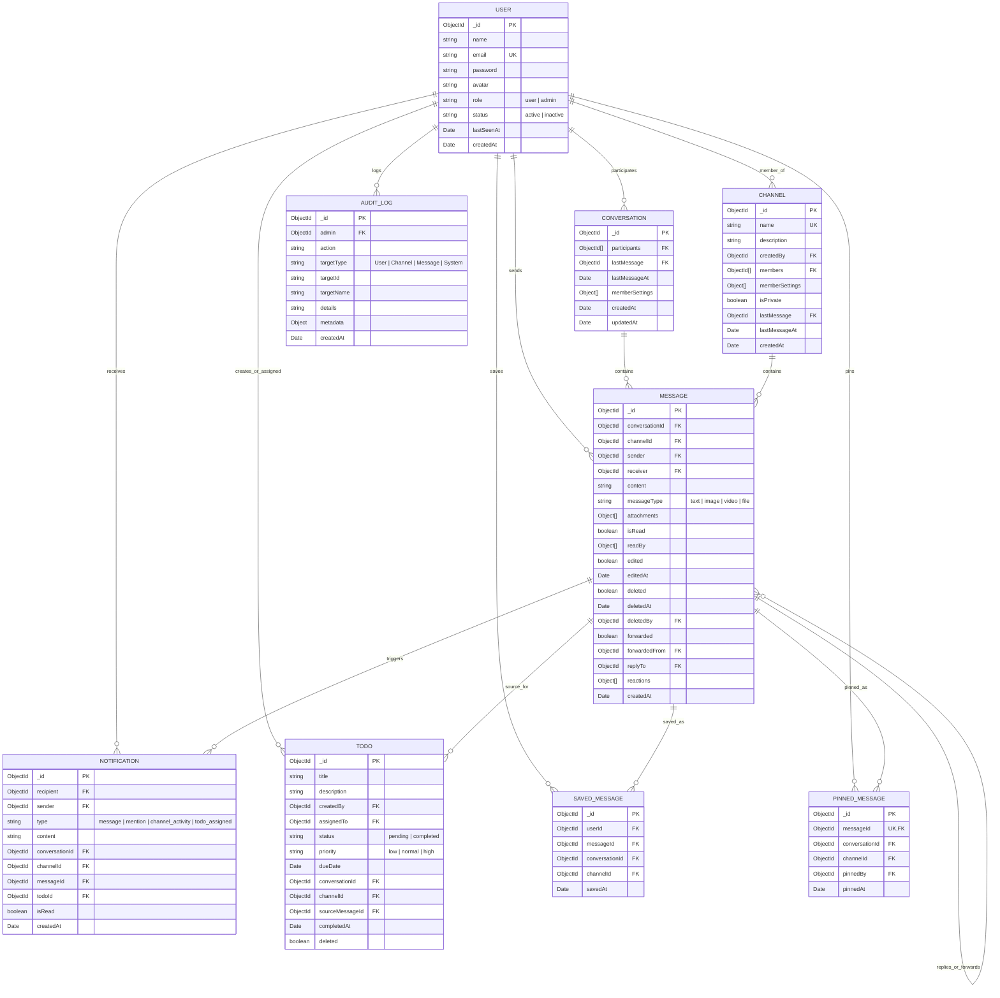

# FLOCK CHATAPP — COMPLETE TECHNICAL LEARNING & CODEBASE DOCUMENTATION

---

## 1. PROJECT OVERVIEW

### 1.1 What This Project Is
**Flock ChatApp** is a real-time team collaboration and workspace communication platform inspired by tools like Flock and Slack. It delivers 1-on-1 direct messaging, team channels (both public and private), multimedia attachment sharing (images, videos up to 100MB, PDFs, documents), message lifecycle operations (edit, soft-delete, forward, reply, reaction bar, save, pin), team directory discovery, real-time presence indicators, in-chat and workspace-wide search, structured task management (To-Dos), and a dedicated governance console (Admin Dashboard) with role-based access control and tamper-evident audit logging.

### 1.2 What Problem It Solves
Modern distributed teams require centralized, low-latency, and persistent communication tools that combine unstructured chatter with structured productivity mechanisms (such as task assignment and message pinning). This application provides a unified workspace where:
- Direct and group discussions happen over WebSockets with real-time updates.
- Tasks/deliverables can be created directly from message conversations and tracked with priority, due dates, and assignee filters.
- Administrators can moderate conversations, manage user account statuses, configure channels, and inspect full audit logs.

### 1.3 Main Features Currently Implemented
1. **Authentication & Session Management**: JWT token-based auth with bcryptjs password hashing, localStorage persistence, and account status enforcement (`active`/`inactive`).
2. **Real-Time 1-to-1 Direct Messaging**: Instant messaging, unread counts, typing indicators, read receipts, and online/offline status tracking with last-seen timestamps.
3. **Team Channels (Public & Private)**: Topic-based group discussions, auto-seeded default channels (`#General`, `#Android Team`, `#HRMS`, `#Ad Promo Team`, `#Project Testing`), member joins/leaves, and creator permissions.
4. **Multimedia File Sharing**: Multer disk-storage upload pipeline supporting images, documents, and video streaming (MP4, WebM, MOV up to 100MB) with an executable blacklist filter.
5. **Advanced Message Actions**:
   - Inline message editing (original sender only) with `(edited)` tag.
   - Soft deletion (original sender or Admin) preserving conversation continuity.
   - Thread-style reply referencing with clickable jump-to-quote navigation.
   - Forwarding messages to any accessible conversation or channel.
   - Clipboard copying of text content and deep permalink generation.
   - Interactive emoji reactions with hover tooltips and real-time aggregate count pills.
6. **Pinned & Saved Messages**:
   - Pinned messages scoped per channel/conversation with role-based pinning authorization.
   - Saved messages scoped privately per user with search and direct navigation.
7. **Task Management (To-Dos)**:
   - Full CRUD task system linked to team conversations, channels, or freestanding workspace context.
   - Filtering by view (`All Tasks`, `My Tasks`), status (`Pending`, `Completed`), priority (`Low`, `Normal`, `High`), and keyword search.
   - Real-time socket synchronization on create, update, complete, and delete.
8. **Smart Notifications & @Mentions**:
   - Unread badge tracking, dropdown feed, and multi-tab read-state synchronization.
   - Automated regex parsing of `@Name` and `@FirstName` mentions in channel chats.
   - Real-time notifications for direct messages, mentions, channel activity, and To-Do assignments.
9. **Global & In-Chat Search**:
   - Unified workspace search across text messages, multimedia attachments, channels, and team users.
   - Filter tabs (`All`, `Messages`, `Files`, `Channels`, `People`) with keyword highlighting.
   - Scoped in-chat message search within the active conversation or channel.
10. **Admin Management & Audit Console**:
    - Aggregated workspace metrics (users, messages, channels, files, unread notifications).
    - User account lifecycle management (role promotion `user` ↔ `admin`, status activation `active` ↔ `inactive`).
    - Channel governance (renaming, privacy toggling, member addition/removal, hard purging).
    - Global message moderation and search.
    - Timestamped, immutable audit log trail of administrative operations.

---

### 1.4 Technology Stack

| Layer | Technology | Version | Purpose |
| :--- | :--- | :--- | :--- |
| **Frontend Framework** | React (Vite) | `^19.2.8` | Component-driven UI rendering with React Hooks |
| **Frontend Build Tool** | Vite | `^8.2.0` | Ultra-fast development server with HMR and proxying |
| **Styling** | Vanilla CSS | Custom tokens | Flexbox/Grid modern dark/light glassmorphic UI design |
| **HTTP Client** | Axios | `^1.19.0` | Promise-based HTTP client with request/response interceptors |
| **WebSocket Client** | socket.io-client | `^4.8.3` | Bidirectional real-time client connection with handshake auth |
| **Backend Runtime** | Node.js | `>=18.x` | Server runtime environment |
| **Backend Framework** | Express | `^5.2.1` | REST API routing, static file serving, and middleware chain |
| **Real-Time Engine** | Socket.IO | `^4.8.3` | Event-driven WebSocket server with room partitioning |
| **Database** | MongoDB | Local/Remote | NoSQL document database |
| **ODM** | Mongoose | `^9.9.3` | Schema definition, validation, indexing, and query building |
| **Authentication** | JSON Web Tokens (`jsonwebtoken`) | `^9.0.3` | Stateless signed token authorization |
| **Password Security** | bcryptjs | `^3.0.3` | One-way password hashing with 10 salt rounds |
| **File Handling** | Multer | `^2.2.0` | Multipart/form-data upload middleware with disk storage |
| **Process Orchestration** | Concurrently | `^9.1.2` | Runs backend and frontend concurrently in development |

---

### 1.5 High-Level Architecture Diagram



---

## 2. PROJECT FOLDER STRUCTURE

```
chatapp/
├── package.json                         # Root monorepo workspace orchestration script (concurrently)
├── backend/                             # Express + Socket.IO + MongoDB REST API backend
│   ├── .env                             # Environment config (PORT, MONGO_URI, JWT_SECRET)
│   ├── package.json                     # Backend dependencies and nodemon runner
│   ├── server.js                        # Main HTTP/WebSocket server entry point
│   ├── config/
│   │   └── db.js                        # Mongoose connection logic with auto-retry
│   ├── models/                          # Mongoose document schemas and indexes
│   │   ├── User.js                      # User accounts, roles, statuses, and timestamps
│   │   ├── Conversation.js              # 1-to-1 direct messaging conversation threads
│   │   ├── Message.js                   # Unified message schema (DMs & Channels, attachments, reactions)
│   │   ├── Channel.js                   # Public/private group channels and members
│   │   ├── Notification.js              # In-app notifications for DMs, mentions, tasks
│   │   ├── PinnedMessage.js             # Pinned message mapping for conversations & channels
│   │   ├── SavedMessage.js              # User-private bookmarked messages
│   │   ├── Todo.js                      # Workspace and conversation-linked task items
│   │   └── AuditLog.js                  # Administrative action history records
│   ├── controllers/                     # Business logic and database operations
│   │   ├── authController.js            # Registration, login, profile verification
│   │   ├── userController.js            # Team contact directory retrieval
│   │   ├── conversationController.js    # DM creation, conversation lists, message sending
│   │   ├── messageController.js         # Edit, delete, forward, read-receipt, reaction handlers
│   │   ├── channelController.js         # Channel creation, join/leave, messaging, auto-seeding
│   │   ├── notificationController.js    # Paginated notifications and read markers
│   │   ├── pinnedMessageController.js   # Pin/unpin operations with permission checks
│   │   ├── savedMessageController.js    # Save/unsave bookmarked messages
│   │   ├── searchController.js          # Unified global search & advanced message filtering
│   │   ├── todoController.js            # To-Do CRUD, assignment, status toggling
│   │   └── adminController.js           # Workspace stats, user/channel/message governance, audit logs
│   ├── middleware/                      # HTTP request filters and validators
│   │   ├── authMiddleware.js            # JWT Bearer token extraction and verification
│   │   ├── adminMiddleware.js           # Strict administrator role check
│   │   └── uploadMiddleware.js          # Multer disk upload with size limits & security extension filtering
│   ├── routes/                          # Express route mapping
│   │   ├── authRoutes.js                # /api/auth endpoints
│   │   ├── userRoutes.js                # /api/users endpoints
│   │   ├── conversationRoutes.js        # /api/conversations endpoints
│   │   ├── messageRoutes.js             # /api/messages endpoints
│   │   ├── channelRoutes.js             # /api/channels endpoints
│   │   ├── notificationRoutes.js        # /api/notifications endpoints
│   │   ├── pinnedMessageRoutes.js       # /api/pinned-messages endpoints
│   │   ├── savedMessageRoutes.js        # /api/saved-messages endpoints
│   │   ├── searchRoutes.js              # /api/search endpoints
│   │   ├── todoRoutes.js                # /api/todos endpoints
│   │   └── adminRoutes.js               # /api/admin endpoints
│   ├── services/                        # Shared utility services
│   │   ├── socketService.js             # Socket.IO connection handling, presence maps, room management
│   │   └── notificationService.js       # @mention regex parser and notification dispatcher
│   └── uploads/                         # Stored uploaded files (served statically via /uploads)
│
└── frontend/                            # React 19 + Vite Single Page Application
    ├── index.html                       # HTML5 template entry point
    ├── vite.config.js                   # Vite dev server configuration and backend proxying
    ├── package.json                     # Frontend dependencies (React, Axios, Socket.IO Client)
    └── src/
        ├── main.jsx                     # ReactDOM root initialization
        ├── App.jsx                      # Authentication state routing (Auth vs AppLayout)
        ├── App.css                      # Global component styles and utility classes
        ├── index.css                    # Base CSS resets and typography definitions
        ├── context/                     # React Context State Providers
        │   ├── AuthContext.jsx          # Login, register, logout, stored token state
        │   ├── SocketContext.jsx        # Socket.IO client lifecycle, presence sets, room emissions
        │   └── NotificationContext.jsx  # Notification state, unread counts, multi-tab sync
        ├── services/                    # Axios API integration modules
        │   ├── api.js                   # Configured Axios instance with auto-token injection
        │   ├── adminService.js          # Admin endpoints wrapper
        │   ├── channelService.js        # Channel endpoints wrapper
        │   ├── conversationService.js   # Conversation settings & read marker wrapper
        │   ├── messageService.js        # Messages, reactions, actions wrapper
        │   ├── notificationService.js   # Notification API wrapper
        │   ├── pinnedMessageService.js  # Pin API wrapper
        │   ├── savedMessageService.js   # Saved message API wrapper
        │   ├── searchService.js         # Unified & scoped search API wrapper
        │   ├── socketService.js         # Socket.IO client singleton connection helper
        │   └── todoService.js           # Task management API wrapper
        ├── pages/                       # Top-level screen views
        │   ├── Login.jsx                # Sign-in form with validation
        │   ├── Register.jsx             # Account registration form
        │   └── AdminDashboard.jsx       # Governance management console with sub-tabs
        ├── components/                  # Modular UI components
        │   ├── layout/                  # Main layout shell
        │   │   ├── AppLayout.jsx        # Core workspace container managing active tabs & socket listeners
        │   │   ├── Header.jsx           # Top bar with title, search input, notification bell, user pill
        │   │   └── Sidebar.jsx          # Left navigation rail (Chats, Channels, To-Dos, Saved, Contacts, Admin)
        │   ├── chat/                    # Direct messaging & message interaction components
        │   │   ├── ChatList.jsx         # Left panel conversation list with search & unread badges
        │   │   ├── ChatListItem.jsx     # Individual conversation row item
        │   │   ├── ChatWindow.jsx       # DM message stream, header actions, typing indicator, message input
        │   │   ├── MessageList.jsx      # Scrollable message feed with date separators and infinite scroll
        │   │   ├── MessageBubble.jsx    # Individual message card (attachments, reactions, hover actions, editor)
        │   │   ├── MessageInput.jsx     # Text input, file attachment button, typing emitter, reply preview
        │   │   ├── AttachmentPreview.jsx# Thumbnail strip for staged files before sending
        │   │   ├── ForwardModal.jsx     # Modal for forwarding a message to other chats/channels
        │   │   ├── MessageInfoModal.jsx # Modal displaying message timestamps and read receipt readers
        │   │   ├── InChatSearch.jsx     # Scoped conversation/channel message search drawer
        │   │   ├── PinnedMessagesPanel.jsx # Slide-over modal listing pinned messages with jump navigation
        │   │   ├── ConversationMenu.jsx # Context menu for mute/unmute and read/unread markers
        │   │   ├── ReactionBar.jsx      # Reaction count badges with hover name tooltips
        │   │   └── EmojiPicker.jsx      # Curated emoji category picker popover
        │   ├── channels/                # Group channel components
        │   │   ├── ChannelList.jsx      # Channel list with unread badges and Create button
        │   │   ├── ChannelItem.jsx      # Individual channel list row item
        │   │   ├── ChannelWindow.jsx    # Group chat stream, member drawer, join/leave controls
        │   │   └── CreateChannelModal.jsx # Modal dialog to create public or private channels
        │   ├── contacts/                # Team directory components
        │   │   ├── ContactList.jsx      # Directory list of colleagues with online indicators
        │   │   └── ContactItem.jsx      # Contact row item with 1-click message launcher
        │   ├── notifications/           # Notification components
        │   │   ├── NotificationBell.jsx # Bell icon with unread count badge
        │   │   └── NotificationDropdown.jsx # Dropdown list of notifications with Mark All Read
        │   ├── search/                  # Global search components
        │   │   └── SearchDropdown.jsx   # Tabbed search results dropdown (Messages, Files, Channels, People)
        │   ├── todos/                   # Task management components
        │   │   ├── TodoPage.jsx         # Full To-Do dashboard (tabs, filters, search, modal launcher)
        │   │   ├── TodoList.jsx         # Grouped task list (Pending, Completed)
        │   │   ├── TodoItem.jsx         # Individual task card (checkbox, priority tag, assignee, context jump)
        │   │   ├── TodoModal.jsx        # Dialog for creating and editing tasks with context linkage
        │   │   └── TodoFilters.jsx      # Filter buttons (All/My, Status, Priority, Sorting)
        │   ├── saved/                   # Bookmarked messages
        │   │   └── SavedMessagesPage.jsx# List of user's saved messages with search and jump navigation
        │   ├── admin/                   # Administration console components
        │   │   ├── AdminHeader.jsx      # Header for admin console with tab labels
        │   │   ├── AdminSidebar.jsx     # Admin navigation rail (Overview, Users, Channels, Messages, Audit)
        │   │   ├── AdminStats.jsx       # Metric cards display
        │   │   ├── UserManagement.jsx   # User table with role and status toggles
        │   │   ├── ChannelManagement.jsx# Channel table with edit, delete, and member management
        │   │   ├── ChannelMembersModal.jsx # Modal to inspect and add/remove channel members
        │   │   ├── MessageManagement.jsx# Moderation table to audit and purge messages
        │   │   ├── AuditLogViewer.jsx   # Timestamped administrative action log viewer
        │   │   └── AdminConfirmModal.jsx# Confirmation dialog for critical admin operations
        │   └── common/                  # Reusable utility components
        │       ├── Avatar.jsx           # User avatar with initials fallback and status dot
        │       ├── EmptyState.jsx       # Placeholder illustration when no chat is selected
        │       └── SearchBar.jsx        # Standardized search input with icon
        └── styles/                      # Modular CSS stylesheets
            ├── layout.css               # Grid layouts and structural containers
            ├── chat.css                 # Chat windows, bubbles, attachments, typing animations
            └── components.css           # Modals, buttons, dropdowns, tables, and admin controls
```

---

## 3. COMPLETE ARCHITECTURE

### 3.1 Architectural Flow (End-to-End)

```
[Browser Client]
       │
       ▼
[React 19 Frontend Components]
       │
   ┌───┴──────────────────────────────┐
   │                                  │
   ▼                                  ▼
[Axios REST API Requests]    [Socket.IO Client WebSocket]
   │                                  │
   ▼                                  ▼
[Vite Dev Server Proxy (Port 5173)]
   │
   ▼
[Node.js HTTP Server (Port 5000)]
   │
   ├──────────────────────────────────┤
   ▼                                  ▼
[Express 5 REST Middleware Pipeline]   [Socket.IO Server (services/socketService.js)]
   │                                  │
   ├─ cors()                          ├─ JWT Handshake Verification
   ├─ express.json()                  ├─ Room Joining: user:<id>, conversation:<id>, channel:<id>
   ├─ express.static('/uploads')      ├─ Presence Tracking: Map<userId, connectionCount>
   ├─ authMiddleware.protect          └─ Real-time Event Broadcaster
   └─ adminMiddleware.adminOnly
   │
   ▼
[Express Controllers] (controllers/*.js)
   │
   ▼
[Mongoose 9 Models] (models/*.js)
   │
   ▼
[MongoDB Database Engine] (mongodb://localhost:27017/flock_clone)
```

### 3.2 Request/Response Flow (REST API)
1. **Client Dispatch**: A user triggers an action (e.g., creating a channel or sending a message). React calls an asynchronous function in `frontend/src/services/`.
2. **Token Injection**: The Axios request interceptor (`frontend/src/services/api.js`) retrieves `chatapp_token` from `localStorage` and appends `Authorization: Bearer <token>` to the HTTP headers.
3. **Proxying**: In development, Vite intercepts `/api/*` and proxies the request to `http://127.0.0.1:5000/api/*`.
4. **Middleware Validation**:
   - `authMiddleware.protect` extracts and decodes the JWT using `process.env.JWT_SECRET`. If valid, it assigns `req.user = { id: decoded.id }` and calls `next()`.
   - Optional `uploadMiddleware.handleUpload` inspects multipart form data, validates file extensions and sizes, writes files to `backend/uploads/`, and attaches `req.files`.
   - Optional `adminMiddleware.adminOnly` queries the database to verify the user has `role === 'admin'` and `status !== 'inactive'`.
5. **Controller Execution**: The controller executes business logic, enforces scoping (e.g., verifying user is a channel member), performs Mongoose queries, and updates document timestamps.
6. **Side Effects & Response**: The controller triggers real-time socket events via `req.app.get('io')` and returns a structured JSON payload (`{ success: true, ... }`).
7. **UI Update**: React receives the response, updates local state, and triggers component re-renders.

### 3.3 Socket.IO Real-Time Flow
1. **Handshake Auth**: When `SocketProvider` mounts in React, `socketService.connectSocket(token)` establishes a connection passing `{ auth: { token } }`.
2. **Server Verification**: The Socket.IO middleware on the server (`backend/services/socketService.js`) verifies the JWT, verifies the user exists in MongoDB, and attaches `socket.user` and `socket.userId`.
3. **Room Subscription**: The socket automatically joins `user:<userId>`. When navigating to a chat or channel, the client emits `conversation:join` or `channel:join`. The server verifies membership and adds the socket to `conversation:<convId>` or `channel:<channelId>`.
4. **Event Emission**: When a new message is saved to MongoDB via the REST API controller, the controller retrieves the initialized `io` instance and emits `message:new` or `channel:message:new` to the target room.
5. **Client Reception**: The `useEffect` listener inside `AppLayout.jsx` receives the payload, appends the message to `messagesMap` or `channelMessagesMap`, updates unread badges, and scrolls the view.

---

## 4. APPLICATION STARTUP FLOW

### 4.1 Backend Startup Sequence (`backend/server.js`)
1. **Environment Initialization**: `dotenv.config()` loads `.env` variables (`PORT=5000`, `MONGO_URI=mongodb://localhost:27017/flock_clone`, `JWT_SECRET=dev_secret_jwt_flock_clone_2026`).
2. **Database Connection**: `connectDB()` in `backend/config/db.js` calls `mongoose.connect(MONGO_URI)`.
   - Upon successful connection, `seedDefaultChannels()` in `backend/controllers/channelController.js` checks if the `channels` collection is empty. If empty, it seeds 5 default channels: `#General`, `#Android Team`, `#HRMS`, `#Ad Promo Team`, and `#Project Testing`.
   - If MongoDB fails to connect initially, it catches the error and retries every 5 seconds without crashing the server process.
3. **HTTP & WebSocket Setup**:
   - `const app = express()` creates the Express app.
   - `const server = http.createServer(app)` wraps Express in a Node HTTP server.
   - `const io = new Server(server, { cors: { origin: '*' } })` binds Socket.IO.
   - `initSocket(io)` configures JWT handshake authentication and room event handlers.
   - `app.set('io', io)` makes the Socket.IO instance accessible inside Express route controllers via `req.app.get('io')`.
4. **Middleware & Route Mounting**:
   - `cors()`, `express.json()`, and static route `app.use('/uploads', express.static(path.join(__dirname, 'uploads')))` are mounted.
   - Route modules (`/api/auth`, `/api/conversations`, `/api/messages`, `/api/channels`, `/api/notifications`, `/api/search`, `/api/todos`, `/api/admin`, etc.) are registered.
5. **Port Binding**: `server.listen(PORT, '0.0.0.0')` binds to port 5000 on all interfaces.

### 4.2 Frontend Startup Sequence (`frontend/src/main.jsx` & `App.jsx`)
1. **React Root**: `main.jsx` renders `<StrictMode><App /></StrictMode>` into `document.getElementById('root')`.
2. **Auth Initialization (`AuthProvider`)**:
   - `AuthContext.jsx` checks `localStorage.getItem('chatapp_token')`.
   - If a token exists, it makes a GET request to `/api/auth/me` to validate the session and load the user object.
   - `loading` is set to `false`.
3. **Conditional Tree Rendering (`App.jsx`)**:
   - While `loading === true`: Renders a "Connecting to ChatApp..." splash card.
   - If `user === null`: Renders `Login.jsx` or `Register.jsx` with a backend health test button.
   - If `user !== null`: Wraps the workspace in `<SocketProvider><NotificationProvider><AppLayout /></NotificationProvider></SocketProvider>`.
4. **Socket & Notification Mount**:
   - `SocketProvider` establishes the authenticated Socket.IO connection.
   - `NotificationProvider` fetches unread counts and recent notifications via `/api/notifications`.
   - `AppLayout` fetches conversation list, channel list, team contacts, and saved message IDs via parallel API calls.

---

## 5. AUTHENTICATION

### 5.1 Registration Flow
1. **User Action**: User enters Name, Email, and Password (min 6 characters) on the Register page.
2. **Frontend**: `Register.jsx` calls `register(name, email, password)` in `AuthContext.jsx`.
3. **API Call**: POST `/api/auth/register` with payload `{ name, email, password }`.
4. **Backend (`authController.registerUser`)**:
   - Validates required fields and password length (`>= 6`).
   - Checks if email is already registered (`User.findOne({ email })`). If exists, returns HTTP 409 Conflict.
   - Hashes the password using `bcrypt.genSalt(10)` and `bcrypt.hash(password, salt)`.
   - Creates document in MongoDB with default `role: 'user'` and `status: 'active'`.
5. **Response**: Returns HTTP 201 with `{ message, user: { id, name, email, role, status } }`.
6. **Frontend UI**: Shows success alert and transitions to the Login view.

### 5.2 Login Flow
1. **User Action**: User submits Email and Password on `Login.jsx`.
2. **Frontend**: Calls `login(email, password)` in `AuthContext.jsx`.
3. **API Call**: POST `/api/auth/login` with `{ email, password }`.
4. **Backend (`authController.loginUser`)**:
   - Normalizes email and finds user document in MongoDB.
   - Verifies user account is not deactivated (`user.status === 'inactive'` returns HTTP 403 Forbidden).
   - Compares plaintext password against hash using `bcrypt.compare(password, user.password)`. If mismatched, returns HTTP 401 Unauthorized.
   - Generates signed JWT: `jwt.sign({ id: user._id }, JWT_SECRET, { expiresIn: '7d' })`.
5. **Response**: Returns HTTP 200 with `{ message: 'Login successful', token, user: { id, name, email, role, status } }`.
6. **Frontend State**: `AuthContext.jsx` saves `token` in `localStorage` under key `chatapp_token`, saves user in `chatapp_user`, and sets `user` state. React re-renders, mounting `AppLayout`.

### 5.3 Session Restoration (`GET /api/auth/me`)
When the browser refreshes, `AuthProvider` reads `chatapp_token` from `localStorage` and queries `GET /api/auth/me`. The server verifies the token and returns the current user profile, restoring session without requiring re-login. If the token is expired or corrupted, `logout()` is called, clearing `localStorage`.

### 5.4 Route Protection Middleware (`authMiddleware.protect`)
```javascript
// backend/middleware/authMiddleware.js
const jwt = require('jsonwebtoken');

const protect = (req, res, next) => {
  let token;
  if (req.headers.authorization && req.headers.authorization.startsWith('Bearer')) {
    try {
      token = req.headers.authorization.split(' ')[1];
      const decoded = jwt.verify(token, process.env.JWT_SECRET);
      req.user = { id: decoded.id };
      return next();
    } catch (error) {
      return res.status(401).json({ message: 'Not authorized, token is invalid or expired' });
    }
  }
  if (!token) {
    return res.status(401).json({ message: 'Not authorized, no token provided' });
  }
};
```

---

## 6. DATABASE ARCHITECTURE

### 6.1 Database Models Summary

| Model | File Path | Primary Collection | Purpose | Key Relationships |
| :--- | :--- | :--- | :--- | :--- |
| **`User`** | `backend/models/User.js` | `users` | User accounts, credentials, roles, online status | Referenced by all models |
| **`Conversation`** | `backend/models/Conversation.js` | `conversations` | 1-to-1 direct messaging threads | `participants` -> `User`, `lastMessage` -> `Message` |
| **`Message`** | `backend/models/Message.js` | `messages` | Unified message records for DMs & channels | `sender`, `receiver` -> `User`, `conversationId`, `channelId`, `replyTo`, `forwardedFrom` -> `Message` |
| **`Channel`** | `backend/models/Channel.js` | `channels` | Public & private group channels | `createdBy`, `members` -> `User`, `lastMessage` -> `Message` |
| **`Notification`** | `backend/models/Notification.js` | `notifications` | In-app alerts for DMs, mentions, tasks | `recipient`, `sender` -> `User`, `conversationId`, `channelId`, `messageId`, `todoId` |
| **`PinnedMessage`** | `backend/models/PinnedMessage.js` | `pinnedmessages` | Pinned messages per conversation/channel | `messageId` -> `Message`, `pinnedBy` -> `User` |
| **`SavedMessage`** | `backend/models/SavedMessage.js` | `savedmessages` | User-private message bookmarks | `userId` -> `User`, `messageId` -> `Message` |
| **`Todo`** | `backend/models/Todo.js` | `todos` | Tasks with priority, due date, assignment | `createdBy`, `assignedTo` -> `User`, `conversationId`, `channelId`, `sourceMessageId` -> `Message` |
| **`AuditLog`** | `backend/models/AuditLog.js` | `auditlogs` | Admin action audit trail | `admin` -> `User` |

---

### 6.2 Database Entity-Relationship Diagram



---

## 7. DIRECT MESSAGING

### 7.1 Complete Feature Flow: Sending a Direct Message

```
User types text & selects file in ChatWindow
       │
       ▼
MessageInput.jsx (`handleSubmit`)
       │ Calls `onSendMessage(content, files, replyToId)`
       ▼
AppLayout.jsx (`handleSendDirectMessage`)
       │ Packages payload (FormData if files, or JSON string)
       ▼
messageService.js (`sendMessage`)
       │ Axios POST /api/conversations/:id/messages
       ▼
conversationController.js (`sendMessage`)
       │ 1. Validates sender is participant in conversation
       │ 2. Detects messageType ('text', 'image', 'video', 'file')
       │ 3. Creates Message document in MongoDB
       │ 4. Updates Conversation.lastMessage & lastMessageAt
       │ 5. Populates sender, receiver, replyTo, forwardedFrom
       │ 6. Emits `message:new` to `conversation:<id>` & `user:<receiverId>`
       │ 7. Calls `notifyDirectMessage()` in notificationService.js
       ▼
MongoDB Database
       │ Inserts Message document & saves updated Conversation
       ▼
Socket.IO Server
       │ Broadcasts `message:new` event
       ▼
Recipient Browser Client (`AppLayout.jsx` useEffect socket listener)
       │ 1. Receives `message:new` payload
       │ 2. Appends message to `messagesMap[convId]`
       │ 3. Updates conversation lastMessage snippet and increments unread count (if chat is not currently open)
       │ 4. If conversation is open, calls `markMessagesAsRead()` and emits `message:read`
       ▼
MessageBubble.jsx
       │ Renders message bubble with avatar, time, read status, attachments, and actions
```

---

## 8. SOCKET.IO / REAL-TIME ARCHITECTURE

### 8.1 Core Principles
- **Authentication**: JWT token sent in `socket.handshake.auth.token`. Verified in server-side middleware before `connection` event fires.
- **Connection Tracking**: Server maintains `userConnections = new Map<userId, connectionCount>()`.
  - When connection count transitions from 0 → 1: Emits `user:online` to all connected clients.
  - When connection count transitions from 1 → 0 on disconnect: Updates user's `lastSeenAt: new Date()` in MongoDB and emits `user:offline` with the timestamp.
- **Room Strategy**:
  - `user:<userId>`: Private personal room for direct notifications and targeted updates.
  - `conversation:<conversationId>`: Shared room for 1-to-1 conversation participants.
  - `channel:<channelId>`: Shared room for channel members.

### 8.2 Master Socket.IO Events Reference Table

| Event Name | Direction | Sender | Receiver | Payload | Purpose | File |
| :--- | :--- | :--- | :--- | :--- | :--- | :--- |
| `users:online` | Server → Client | Socket Server | Connecting Client | `{ onlineUserIds: string[] }` | Initial online presence list | `socketService.js` |
| `user:online` | Server → Client | Socket Server | All Clients | `{ userId, userName }` | Broadcast user logged on | `socketService.js` |
| `user:offline` | Server → Client | Socket Server | All Clients | `{ userId, lastSeenAt }` | Broadcast user logged off | `socketService.js` |
| `conversation:join` | Client → Server | Client | Socket Server | `{ conversationId }` | Authorize & join DM room | `socketService.js` |
| `conversation:leave`| Client → Server | Client | Socket Server | `{ conversationId }` | Leave DM room | `socketService.js` |
| `channel:join` | Client → Server | Client | Socket Server | `{ channelId }` | Authorize & join channel room | `socketService.js` |
| `channel:leave` | Client → Server | Client | Socket Server | `{ channelId }` | Leave channel room | `socketService.js` |
| `typing` | Client → Server → Client | Sender Client | Other Participant in DM | `{ conversationId, userId, userName }` | Direct chat typing indicator | `socketService.js` |
| `stop_typing` | Client → Server → Client | Sender Client | Other Participant in DM | `{ conversationId, userId }` | Stop typing indicator in DM | `socketService.js` |
| `channel:typing` | Client → Server → Client | Sender Client | Channel Room Members | `{ channelId, userId, userName }` | Channel typing indicator | `socketService.js` |
| `channel:stop_typing` | Client → Server → Client | Sender Client | Channel Room Members | `{ channelId, userId }` | Channel stop typing indicator | `socketService.js` |
| `message:new` | Server → Client | Message Controller | DM Participants | `{ message: MessageDoc }` | Real-time direct message delivery | `conversationController.js` |
| `channel:message:new` | Server → Client | Channel Controller | Channel Members | `{ message: MessageDoc }` | Real-time channel message delivery | `channelController.js` |
| `message:edited` | Server → Client | Message Controller | DM or Channel Room | `{ messageId, content, edited, editedAt, message }` | Real-time message update | `messageController.js` |
| `message:deleted` | Server → Client | Message Controller | DM or Channel Room | `{ messageId, deleted: true, deletedAt, deletedBy, message }` | Real-time message deletion | `messageController.js` |
| `message:read` | Server → Client | Message Controller | Conversation/Channel Room | `{ conversationId, channelId, messageIds, userId, readAt }` | Real-time read receipt update | `messageController.js` |
| `message:reaction:updated` | Server → Client | Message Controller | DM or Channel Room | `{ messageId, reactions: [...] }` | Real-time emoji reaction update | `messageController.js` |
| `message:pinned` | Server → Client | Pin Controller | DM or Channel Room | `{ messageId, conversationId, channelId, pinnedBy, pinnedAt }` | Real-time pin addition | `pinnedMessageController.js` |
| `message:unpinned` | Server → Client | Pin Controller | DM or Channel Room | `{ messageId, conversationId, channelId }` | Real-time pin removal | `pinnedMessageController.js` |
| `channel:created` | Server → Client | Channel Controller | All Clients (public) or Creator | `{ channel: ChannelDoc }` | Real-time channel discovery | `channelController.js` |
| `channel:updated` | Server → Client | Channel/Admin Ctrl | All Clients | `{ channel: ChannelDoc, leftUserId? }` | Real-time channel updates | `channelController.js` |
| `channel:deleted` | Server → Client | Admin Controller | All Clients | `{ channelId }` | Real-time channel purge | `adminController.js` |
| `notification:new` | Server → Client | Notification Service| `user:<recipientId>` | `{ notification: NotificationDoc }` | Real-time notification badge & item | `notificationService.js` |
| `notification:read`| Server → Client | Notification Ctrl | `user:<userId>` | `{ notificationId }` | Multi-tab notification read sync | `notificationController.js` |
| `notifications:read_all` | Server → Client | Notification Ctrl | `user:<userId>` | `{ userId }` | Multi-tab read-all sync | `notificationController.js` |
| `todo:created` | Server → Client | Todo Controller | Assignee, Creator & Context Rooms | `{ todo: TodoDoc, todoId, conversationId, channelId }` | Real-time To-Do creation | `todoController.js` |
| `todo:updated` | Server → Client | Todo Controller | Assignee, Creator & Context Rooms | `{ todo: TodoDoc, todoId, conversationId, channelId }` | Real-time To-Do modification | `todoController.js` |
| `todo:completed` | Server → Client | Todo Controller | Assignee, Creator & Context Rooms | `{ todo: TodoDoc, todoId, conversationId, channelId }` | Real-time To-Do completion toggle | `todoController.js` |
| `todo:deleted` | Server → Client | Todo Controller | Assignee, Creator & Context Rooms | `{ todoId, conversationId, channelId, createdBy, assignedTo }` | Real-time To-Do deletion | `todoController.js` |

---

## 9. CHANNELS / GROUPS

### 9.1 Channel Lifecycle & Permissions
- **Public Channels (`isPrivate: false`)**: Visible in the Channels list to all workspace members. Any user can join via `POST /api/channels/:id/join`. When created, the server emits `channel:created` globally via `io.emit()`.
- **Private Channels (`isPrivate: true`)**: Only visible to users who are members (`members: userId`) or the creator. Self-joining without an invitation/admin is rejected with HTTP 403. Emitted only to the creator's private room `user:<userId>` upon creation.
- **Auto-Seeding**: If the database collection is empty at startup, `seedDefaultChannels()` populates 5 default public channels with all existing users as members.
- **Channel Membership Operations**:
  - `POST /api/channels/:id/join`: Adds authenticated user ID to `members` array and emits `channel:updated`.
  - `POST /api/channels/:id/leave`: Removes user ID from `members` array and emits `channel:updated` with `leftUserId`.
  - `POST /api/channels/:id/messages`: Only members can send messages; non-members receive HTTP 403.
- **Channel UI (`ChannelWindow.jsx`)**: Displays non-member banner preview with large "Join Channel" button if user has not yet joined.

---

## 10. NOTIFICATIONS

### 10.1 Schema & Types
The `Notification` model (`backend/models/Notification.js`) supports 4 distinct notification types:
1. `message`: Sent on incoming 1-to-1 direct messages.
2. `mention`: Sent when a user is specifically mentioned using `@Name` in a group channel.
3. `channel_activity`: Sent to channel members on new messages when not directly mentioned (unless channel is muted).
4. `todo_assigned`: Sent to the assignee when a colleague creates or reassigns a To-Do task to them.

### 10.2 Notification Delivery & Synchronization
1. Notifications are created in MongoDB with `isRead: false`.
2. The server emits `notification:new` to `user:<recipientId>`.
3. `NotificationContext.jsx` increments `unreadCount` and prepends the notification to `notifications`.
4. Marking notifications as read via `PATCH /api/notifications/:id/read` or `PATCH /api/notifications/read-all` updates MongoDB and emits `notification:read` or `notifications:read_all` back to `user:<userId>` so all open browser tabs for that user synchronize instantly.

---

## 11. @MENTIONS

### 11.1 Mention Detection Logic (`backend/services/notificationService.js`)
When a message is sent to a channel, `parseMentions(content)` executes:
1. Inspects if `content.includes('@')`.
2. Queries all workspace users (`User.find().select('_id name email avatar')`).
3. For each user, creates regex patterns matching both full name with word boundaries (e.g. `@Dinesh J\b`) and first name (e.g. `@Dinesh\b`).
4. Matched users receive a notification of type `mention` with content: `"[Sender] mentioned you in #[ChannelName]"`.
5. Channel members who were *not* mentioned receive a standard `channel_activity` notification (unless they have muted the channel).

---

## 12. MESSAGE FEATURES

### 12.1 Master Message Operations Table

| Feature | UI Component | Frontend Service | API Endpoint / Socket Event | Backend Controller Function | Database Operation | Resulting UI Change |
| :--- | :--- | :--- | :--- | :--- | :--- | :--- |
| **Send Text / Files** | `MessageInput.jsx` | `messageService.sendMessage` | POST `/api/conversations/:id/messages`<br>Emit `message:new` | `conversationController.sendMessage` | `Message.create()`, `Conversation.save()` | Message bubble appears, input resets, scroll to bottom |
| **Send in Channel** | `MessageInput.jsx` | `channelService.sendChannelMessage` | POST `/api/channels/:id/messages`<br>Emit `channel:message:new` | `channelController.sendChannelMessage` | `Message.create()`, `Channel.save()` | Channel message appears, notification sent to members |
| **Inline Edit** | `MessageBubble.jsx` | `messageService.editMessage` | PATCH `/api/messages/:id`<br>Emit `message:edited` | `messageController.editMessage` | `Message.updateOne({ content, edited: true, editedAt })` | Content updates, `(edited)` badge displayed |
| **Soft Delete** | `MessageBubble.jsx` | `messageService.deleteMessage` | DELETE `/api/messages/:id`<br>Emit `message:deleted` | `messageController.deleteMessage` | `Message.updateOne({ deleted: true, content: 'This message was deleted', attachments: [] })` | Bubble turns italic with "This message was deleted" |
| **Reply to Message** | `MessageBubble.jsx` + `MessageInput.jsx` | `messageService.sendMessage` | POST `/api/conversations/:id/messages` (with `replyTo`) | `conversationController.sendMessage` | `Message.create({ replyTo: id })` | Rendered with clickable quote block jump link |
| **Forward Message** | `ForwardModal.jsx` | `messageService.forwardMessage` | POST `/api/messages/:id/forward` | `messageController.forwardMessage` | `Message.create({ forwarded: true, forwardedFrom })` | Message posted to destination with `↪ Forwarded` tag |
| **Copy Text** | `MessageBubble.jsx` | `navigator.clipboard` | None (Client-side) | None | None | Toast indicator "Copied!" appears for 2s |
| **Copy Message Link**| `MessageBubble.jsx`| `navigator.clipboard` | None (Client-side permalink) | None | None | Deep permalink copied to clipboard with toast |
| **Add Reaction** | `ReactionBar.jsx` / `EmojiPicker.jsx` | `messageService.addReaction` | POST `/api/messages/:id/reactions`<br>Emit `message:reaction:updated` | `messageController.addReaction` | `Message.updateOne({ $addToSet: { 'reactions.$.users': userId } })` | Reaction pill count increments, tooltip updates |
| **Remove Reaction** | `ReactionBar.jsx` | `messageService.removeReaction`| DELETE `/api/messages/:id/reactions/:emoji`<br>Emit `message:reaction:updated` | `messageController.removeReaction` | `Message.updateOne({ $pull: { 'reactions.$.users': userId } })` | Reaction pill decrements or disappears |
| **Pin Message** | `MessageBubble.jsx` | `pinnedMessageService.pinMessage` | POST `/api/pinned-messages/:id/pin`<br>Emit `message:pinned` | `pinnedMessageController.pinMessage` | `PinnedMessage.create({ messageId, pinnedBy })` | 📌 icon appears on bubble and added to Pinned panel |
| **Unpin Message** | `MessageBubble.jsx` | `pinnedMessageService.unpinMessage` | DELETE `/api/pinned-messages/:id/pin`<br>Emit `message:unpinned` | `pinnedMessageController.unpinMessage` | `PinnedMessage.deleteOne({ messageId })` | 📌 icon removed and removed from Pinned panel |
| **Save Message** | `MessageBubble.jsx` | `savedMessageService.saveMessage` | POST `/api/saved-messages/:id/save` | `savedMessageController.saveMessage` | `SavedMessage.create({ userId, messageId })` | 🔖 bookmark indicator active, visible in Saved tab |
| **Unsave Message** | `MessageBubble.jsx` | `savedMessageService.unsaveMessage` | DELETE `/api/saved-messages/:id/save` | `savedMessageController.unsaveMessage` | `SavedMessage.deleteOne({ userId, messageId })` | 🔖 bookmark indicator removed |
| **Message Info** | `MessageInfoModal.jsx` | `messageService.getMessage` | GET `/api/messages/:id` | `messageController.getMessageById` | `Message.findById()` | Modal displays sent time, edit time, read receipts |

---

## 13. SEARCH

### 13.1 Global Search (`Header.jsx` & `SearchDropdown.jsx`)
- **Execution**: As user types in header search, `Header.jsx` debounces (300ms) and calls `searchAll(query, filter)` (`GET /api/search?q=...&type=...`).
- **Authorization Scoping**: `searchController.getUserAccessibleScope` ensures users can only search messages from DM conversations they participate in and channels they are members of (or public channels).
- **Categorized Results**:
  - `messages`: Matches in text content.
  - `files`: Matches in attachment filenames or message media types (`image`, `video`, `file`).
  - `channels`: Matches in channel names or descriptions.
  - `users`: Matches in user full names or email addresses.
- **Highlighting**: `HighlightMatch` component wraps matching substring tokens in `<mark className="search-highlight">`.
- **Navigation**: Clicking any result closes the dropdown, switches to the appropriate tab (`chats`, `channels`, `contacts`), selects the entity, and scrolls/highlights the target message for 4 seconds (`highlightedMessageId`).

### 13.2 In-Chat Scoped Search (`InChatSearch.jsx`)
- Opened from the search icon in `ChatWindow` or `ChannelWindow`.
- Scopes query directly to `GET /api/search/messages?q=...&conversationId=...` or `channelId=...`.
- Clicking a search result jumps directly to that message in the active feed.

---

## 14. TODOS / TASK MANAGEMENT

### 14.1 Task Lifecycle & Context Linkage
- **Model (`backend/models/Todo.js`)**: Fields include `title`, `description`, `createdBy`, `assignedTo`, `status` (`pending`, `completed`), `priority` (`low`, `normal`, `high`), `dueDate`, `conversationId`, `channelId`, `sourceMessageId`, `completedAt`, and soft-delete fields (`deleted`, `deletedAt`, `deletedBy`).
- **Context Linkage**:
  - Freestanding task: Not linked to any chat.
  - Conversation task: Created from `ChatWindow` with `conversationId`.
  - Channel task: Created from `ChannelWindow` with `channelId`.
  - Message task: Created via `☑️` action on `MessageBubble`, preserving `sourceMessageId` and displaying a snippet of the source message.
- **Tabs & Filters (`TodoPage.jsx` & `TodoFilters.jsx`)**:
  - `All Tasks`: Tasks created by user, assigned to user, or belonging to user's channels/conversations.
  - `My Tasks`: Strictly tasks where `assignedTo === currentUserId`.
  - Status filter: `All`, `Pending`, `Completed`.
  - Priority filter: `All`, `Low`, `Normal`, `High`.
  - Sorting: `Default`, `Due Date`, `Created Date`, `Priority`.

---

## 15. SAVED / PINNED MESSAGES

### 15.1 Pinned Messages
- **Scope**: Public to all participants of a conversation or channel.
- **Permissions**:
  - Direct Conversations: Both participants can pin/unpin messages.
  - Channels: Only the channel creator or a workspace Admin can pin/unpin messages.
- **Panel (`PinnedMessagesPanel.jsx`)**: Slide-over drawer accessible via header 📌 button listing all pinned messages in the chat with author, snippet, pinned timestamp, and 1-click jump navigation.

### 15.2 Saved Messages (`SavedMessagesPage.jsx`)
- **Scope**: Strictly private to the authenticated user (`SavedMessage` collection indexed by `{ userId, messageId }`).
- **Features**: Accessible via the "Saved Messages" sidebar tab, supports text keyword search, displays original context (`#Channel` or Direct Message), and navigates directly to the original conversation on click.

---

## 16. FRONTEND ARCHITECTURE

### 16.1 Component Hierarchy & Communication

```mermaid
graph TD
    App[App.jsx] --> AuthProvider[AuthProvider: AuthContext]
    AuthProvider --> MainApp[MainApp]
    MainApp -->|Unauthenticated| Login[Login.jsx]
    MainApp -->|Unauthenticated| Register[Register.jsx]
    MainApp -->|Authenticated| SocketProvider[SocketProvider: SocketContext]
    SocketProvider --> NotificationProvider[NotificationProvider: NotificationContext]
    NotificationProvider --> AppLayout[AppLayout.jsx]

    AppLayout --> Sidebar[Sidebar.jsx]
    AppLayout --> Header[Header.jsx]
    Header --> SearchBar[SearchBar.jsx]
    Header --> SearchDropdown[SearchDropdown.jsx]
    Header --> NotificationBell[NotificationBell.jsx]
    NotificationBell --> NotificationDropdown[NotificationDropdown.jsx]

    AppLayout -->|activeTab === 'chats'| ChatList[ChatList.jsx]
    ChatList --> ChatListItem[ChatListItem.jsx]
    AppLayout -->|activeTab === 'chats' & selectedChat| ChatWindow[ChatWindow.jsx]
    ChatWindow --> InChatSearch[InChatSearch.jsx]
    ChatWindow --> MessageList[MessageList.jsx]
    MessageList --> MessageBubble[MessageBubble.jsx]
    MessageBubble --> ReactionBar[ReactionBar.jsx]
    MessageBubble --> EmojiPicker[EmojiPicker.jsx]
    ChatWindow --> MessageInput[MessageInput.jsx]
    MessageInput --> AttachmentPreview[AttachmentPreview.jsx]
    ChatWindow --> ForwardModal[ForwardModal.jsx]
    ChatWindow --> MessageInfoModal[MessageInfoModal.jsx]
    ChatWindow --> PinnedMessagesPanel[PinnedMessagesPanel.jsx]
    ChatWindow --> ConversationMenu[ConversationMenu.jsx]

    AppLayout -->|activeTab === 'channels'| ChannelList[ChannelList.jsx]
    ChannelList --> ChannelItem[ChannelItem.jsx]
    ChannelList --> CreateChannelModal[CreateChannelModal.jsx]
    AppLayout -->|activeTab === 'channels' & selectedChannel| ChannelWindow[ChannelWindow.jsx]

    AppLayout -->|activeTab === 'contacts'| ContactList[ContactList.jsx]
    ContactList --> ContactItem[ContactItem.jsx]

    AppLayout -->|activeTab === 'todos'| TodoPage[TodoPage.jsx]
    TodoPage --> TodoFilters[TodoFilters.jsx]
    TodoPage --> TodoList[TodoList.jsx]
    TodoList --> TodoItem[TodoItem.jsx]
    TodoPage --> TodoModal[TodoModal.jsx]

    AppLayout -->|activeTab === 'saved'| SavedMessagesPage[SavedMessagesPage.jsx]

    AppLayout -->|activeTab === 'admin'| AdminDashboard[AdminDashboard.jsx]
    AdminDashboard --> AdminSidebar[AdminSidebar.jsx]
    AdminDashboard --> AdminHeader[AdminHeader.jsx]
    AdminDashboard --> AdminStats[AdminStats.jsx]
    AdminDashboard --> UserManagement[UserManagement.jsx]
    AdminDashboard --> ChannelManagement[ChannelManagement.jsx]
    ChannelManagement --> ChannelMembersModal[ChannelMembersModal.jsx]
    AdminDashboard --> MessageManagement[MessageManagement.jsx]
    AdminDashboard --> AuditLogViewer[AuditLogViewer.jsx]
```



---

## 17. BACKEND ARCHITECTURE

### 17.1 Backend Request Lifecycle

```
HTTP Request (Client)
   │
   ▼
server.js (Express Application Entry)
   │
   ├─► Global Middlewares: cors(), express.json(), express.static('/uploads')
   │
   ▼
routes/*.js (Route Handlers)
   │
   ├─► authMiddleware.protect (Verify JWT & assign req.user)
   ├─► adminMiddleware.adminOnly (Verify req.user.role === 'admin')
   ├─► uploadMiddleware.handleUpload (Multer multipart disk storage)
   │
   ▼
controllers/*.js (Business Logic & Database Actions)
   │
   ├─► Mongoose CRUD on models/*.js
   ├─► notificationService.js (Mention parser & notification creation)
   ├─► req.app.get('io').emit(...) (Socket.IO event broadcasting)
   │
   ▼
HTTP JSON Response ({ success: true, ... })
```

---

## 18. IMPORTANT FILES TO STUDY

### LEVEL 1 — MUST UNDERSTAND (Core System)
1. **`backend/server.js`**: Server initialization, Socket.IO binding, route registry, channel seeding.
2. **`backend/middleware/authMiddleware.js`**: JWT Bearer token authentication mechanism.
3. **`backend/services/socketService.js`**: WebSocket connection lifecycle, presence tracking, room joining.
4. **`backend/models/Message.js`**: Central schema for all direct and group communications, reactions, and attachments.
5. **`backend/controllers/conversationController.js`**: Core 1-on-1 direct messaging and conversation logic.
6. **`frontend/src/context/AuthContext.jsx`**: Frontend authentication state, login/register/logout handlers.
7. **`frontend/src/context/SocketContext.jsx`**: Frontend Socket.IO connection and presence state.
8. **`frontend/src/components/layout/AppLayout.jsx`**: Workspace master coordinator, socket event listeners, tab switching.
9. **`frontend/src/components/chat/ChatWindow.jsx`**: Direct messaging user interface and feature controls.
10. **`frontend/src/components/chat/MessageBubble.jsx`**: Message bubble rendering, actions (edit, delete, reply, react, pin, save).

### LEVEL 2 — IMPORTANT (Key Feature Areas)
11. **`backend/controllers/channelController.js`**: Group channel management, membership, permissions.
12. **`backend/controllers/messageController.js`**: Message actions (edit, delete, forward, reactions, read receipts).
13. **`backend/controllers/todoController.js`**: Task management CRUD, assignments, status toggling.
14. **`backend/services/notificationService.js`**: Regex @mention parsing and notification dispatch.
15. **`backend/controllers/searchController.js`**: Unified search and accessible scope filtering.
16. **`backend/controllers/adminController.js`**: Workspace governance, user management, audit logging.
17. **`frontend/src/context/NotificationContext.jsx`**: Notification state and multi-tab synchronization.
18. **`frontend/src/components/todos/TodoPage.jsx`**: Task management UI, filters, real-time synchronization.
19. **`frontend/src/pages/AdminDashboard.jsx`**: Administrator dashboard navigation and metrics.

### LEVEL 3 — SUPPORTING (Utilities & Models)
20. **`backend/config/db.js`**: MongoDB connection with reconnect loop.
21. **`backend/middleware/uploadMiddleware.js`**: Multer disk storage and file extension blacklist.
22. **`backend/models/User.js`**, **`Channel.js`**, **`Todo.js`**, **`Notification.js`**, **`AuditLog.js`**, **`PinnedMessage.js`**, **`SavedMessage.js`**.
23. **`frontend/src/services/api.js`**: Axios instance and request interceptors.
24. **`frontend/src/components/search/SearchDropdown.jsx`**: Global search category tabs and highlighting.

### LEVEL 4 — LOW PRIORITY (Presentational & Static)
25. **`frontend/src/components/common/Avatar.jsx`**, **`EmptyState.jsx`**, **`SearchBar.jsx`**.
26. **`frontend/src/styles/layout.css`**, **`chat.css`**, **`components.css`**.

---

## 19. IMPORTANT FUNCTIONS

| Function | File | Purpose | Called By | Calls / Uses | Feature |
| :--- | :--- | :--- | :--- | :--- | :--- |
| `connectDB` | `backend/config/db.js` | Connects Mongoose to MongoDB with retry | `backend/server.js` | `mongoose.connect` | Database Connection |
| `initSocket` | `backend/services/socketService.js` | Initializes Socket.IO auth & listeners | `backend/server.js` | `jwt.verify`, `User.findById` | Real-time Architecture |
| `protect` | `backend/middleware/authMiddleware.js`| Verifies JWT Bearer token on routes | All protected route files | `jwt.verify` | Security / Auth |
| `adminOnly` | `backend/middleware/adminMiddleware.js`| Restricts routes to active admins | `backend/routes/adminRoutes.js` | `User.findById` | Authorization |
| `registerUser` | `backend/controllers/authController.js`| Registers new user with hashed password | `backend/routes/authRoutes.js` | `bcrypt.hash`, `User.create` | Authentication |
| `loginUser` | `backend/controllers/authController.js`| Authenticates user & returns JWT | `backend/routes/authRoutes.js` | `bcrypt.compare`, `jwt.sign` | Authentication |
| `sendMessage` | `backend/controllers/conversationController.js`| Sends DM, updates thread, emits socket | `backend/routes/conversationRoutes.js` | `Message.create`, `notifyDirectMessage` | Direct Messaging |
| `sendChannelMessage`| `backend/controllers/channelController.js`| Sends channel message & parses @mentions | `backend/routes/channelRoutes.js` | `Message.create`, `notifyChannelMessage` | Group Channels |
| `parseMentions` | `backend/services/notificationService.js`| Regex searches @Name in text | `notifyChannelMessage` | `User.find`, RegExp | @Mentions |
| `editMessage` | `backend/controllers/messageController.js`| Edits text content of own message | `backend/routes/messageRoutes.js` | `Message.save`, `io.emit` | Message Actions |
| `deleteMessage` | `backend/controllers/messageController.js`| Soft-deletes message for all users | `backend/routes/messageRoutes.js` | `Message.save`, `io.emit` | Message Actions |
| `addReaction` | `backend/controllers/messageController.js`| Adds emoji reaction to message | `backend/routes/messageRoutes.js` | `Message.updateOne`, `io.emit` | Reactions |
| `createTodo` | `backend/controllers/todoController.js`| Creates task with context linkage | `backend/routes/todoRoutes.js` | `Todo.create`, `notifyTodoAssigned`| Tasks / To-Dos |
| `searchAll` | `backend/controllers/searchController.js`| Unified search across 4 entity types | `backend/routes/searchRoutes.js` | `getUserAccessibleScope`, `Message.find` | Search |
| `createAuditRecord`| `backend/controllers/adminController.js`| Logs administrative actions | Admin controller endpoints | `AuditLog.create` | Governance |
| `connectSocket` | `frontend/src/services/socketService.js`| Establishes client Socket.IO singleton | `SocketProvider` | `io(SOCKET_URL)` | Real-time Client |

---

## 20. IMPORTANT REACT COMPONENTS

| Component | File | Responsibility | Parent / Usage | Important State / Props |
| :--- | :--- | :--- | :--- | :--- |
| **`AppLayout`** | `components/layout/AppLayout.jsx` | Core workspace state manager & socket listener hub | `App.jsx` | `activeTab`, `selectedChat`, `selectedChannel`, `messagesMap` |
| **`ChatWindow`** | `components/chat/ChatWindow.jsx` | 1-to-1 conversation view, typing display, actions | `AppLayout.jsx` | Props: `chat`, `messages`, `onSendMessage`, `onReaction` |
| **`ChannelWindow`**| `components/channels/ChannelWindow.jsx`| Group channel view, member drawer, join/leave controls | `AppLayout.jsx` | Props: `channel`, `messages`, `onJoinChannel`, `onLeaveChannel` |
| **`MessageBubble`**| `components/chat/MessageBubble.jsx` | Single message card with media player & action bar | `MessageList.jsx` | State: `isEditing`, `showReactionPicker`; Props: `message`, `onReaction` |
| **`MessageInput`** | `components/chat/MessageInput.jsx` | Text input, file staging strip, typing emission | `ChatWindow` / `ChannelWindow` | State: `text`, `selectedFiles`; Props: `onSendMessage`, `replyingTo` |
| **`TodoPage`** | `components/todos/TodoPage.jsx` | Full task management screen with filters and search | `AppLayout.jsx` | State: `activeView`, `statusFilter`, `priorityFilter`, `todos` |
| **`AdminDashboard`**| `pages/AdminDashboard.jsx` | Administrative governance portal | `AppLayout.jsx` | State: `activeTab` (`overview`, `users`, `channels`, `messages`, `audit-logs`) |
| **`SearchDropdown`**| `components/search/SearchDropdown.jsx`| Global search results dropdown with tabs & highlights | `Header.jsx` | Props: `query`, `results`, `activeFilter`, `onSelectResult` |
| **`NotificationBell`**| `components/notifications/NotificationBell.jsx`| Bell icon button with unread count badge & dropdown | `Header.jsx` | Context: `useNotifications()` (`unreadCount`, `notifications`) |

---

## 21. IMPORTANT API ENDPOINTS

| HTTP Method | Endpoint | Purpose | Authentication | Controller Function | Frontend Caller |
| :--- | :--- | :--- | :--- | :--- | :--- |
| `POST` | `/api/auth/register` | Register new user account | Public | `authController.registerUser` | `AuthContext.register` |
| `POST` | `/api/auth/login` | Authenticate user & receive JWT | Public | `authController.loginUser` | `AuthContext.login` |
| `GET` | `/api/auth/me` | Restore user session from token | Protected (`protect`) | `authController.getMe` | `AuthContext.loadUser` |
| `GET` | `/api/users` | Get team directory contacts | Protected (`protect`) | `userController.getTeamUsers` | `messageService.getTeamUsers` |
| `GET` | `/api/conversations` | Get user's active DM conversations | Protected (`protect`) | `conversationController.getUserConversations` | `messageService.getConversations` |
| `POST` | `/api/conversations` | Create or get existing 1-on-1 DM | Protected (`protect`) | `conversationController.createOrGetConversation` | `messageService.createOrGetConversation` |
| `GET` | `/api/conversations/:id/messages` | Get message history for DM | Protected (`protect`) | `conversationController.getConversationMessages` | `messageService.getMessages` |
| `POST` | `/api/conversations/:id/messages` | Send DM (text or file attachment) | Protected (`protect` + `upload`) | `conversationController.sendMessage` | `messageService.sendMessage` |
| `GET` | `/api/channels` | Get all accessible channels | Protected (`protect`) | `channelController.getChannels` | `channelService.getChannels` |
| `POST` | `/api/channels` | Create a new channel | Protected (`protect`) | `channelController.createChannel` | `channelService.createChannel` |
| `POST` | `/api/channels/:id/join` | Join a public channel | Protected (`protect`) | `channelController.joinChannel` | `channelService.joinChannel` |
| `POST` | `/api/channels/:id/leave` | Leave a channel | Protected (`protect`) | `channelController.leaveChannel` | `channelService.leaveChannel` |
| `GET` | `/api/channels/:id/messages` | Get message history for channel | Protected (`protect`) | `channelController.getChannelMessages` | `channelService.getChannelMessages` |
| `POST` | `/api/channels/:id/messages` | Send message in channel | Protected (`protect` + `upload`) | `channelController.sendChannelMessage` | `channelService.sendChannelMessage` |
| `PATCH` | `/api/messages/:id` | Edit message content | Protected (`protect`) | `messageController.editMessage` | `messageService.editMessage` |
| `DELETE`| `/api/messages/:id` | Soft-delete message | Protected (`protect`) | `messageController.deleteMessage` | `messageService.deleteMessage` |
| `POST` | `/api/messages/:id/forward` | Forward message to chat/channel | Protected (`protect`) | `messageController.forwardMessage` | `messageService.forwardMessage` |
| `POST` | `/api/messages/:id/reactions` | Add emoji reaction to message | Protected (`protect`) | `messageController.addReaction` | `messageService.addReaction` |
| `DELETE`| `/api/messages/:id/reactions/:emoji`| Remove emoji reaction | Protected (`protect`) | `messageController.removeReaction` | `messageService.removeReaction` |
| `GET` | `/api/notifications` | Get paginated notification feed | Protected (`protect`) | `notificationController.getNotifications` | `notificationService.getNotifications` |
| `PATCH` | `/api/notifications/:id/read` | Mark single notification as read | Protected (`protect`) | `notificationController.markNotificationRead` | `notificationService.markNotificationRead` |
| `PATCH` | `/api/notifications/read-all` | Mark all notifications as read | Protected (`protect`) | `notificationController.markAllNotificationsRead` | `notificationService.markAllNotificationsRead` |
| `GET` | `/api/todos` | Get filtered To-Dos | Protected (`protect`) | `todoController.getTodos` | `todoService.getTodos` |
| `POST` | `/api/todos` | Create a new To-Do | Protected (`protect`) | `todoController.createTodo` | `todoService.createTodo` |
| `PATCH` | `/api/todos/:id/status` | Toggle task pending ↔ completed | Protected (`protect`) | `todoController.toggleTodoStatus` | `todoService.toggleTodoStatus` |
| `GET` | `/api/search` | Unified global workspace search | Protected (`protect`) | `searchController.searchAll` | `searchService.searchAll` |
| `GET` | `/api/admin/stats` | Get workspace governance stats | Protected (`protect` + `adminOnly`) | `adminController.getWorkspaceStats` | `adminService.getWorkspaceStats` |
| `PATCH` | `/api/admin/users/:id/role` | Update user role (`user`/`admin`) | Protected (`protect` + `adminOnly`) | `adminController.updateUserRole` | `adminService.updateAdminUserRole` |
| `DELETE`| `/api/admin/messages/:id` | Hard delete message for moderation | Protected (`protect` + `adminOnly`) | `adminController.deleteMessage` | `adminService.deleteAdminMessage` |
| `GET` | `/api/admin/audit-logs` | Retrieve admin action logs | Protected (`protect` + `adminOnly`) | `adminController.getAuditLogs` | `adminService.getAdminAuditLogs` |

---

## 22. SOCKET.IO EVENT REFERENCE

*(See Section 8.2 for the comprehensive master table detailing all 27 socket events, direction, payload structure, and files).*

---

## 23. DATA FLOW EXAMPLES

### Flow 1: User Registration
`Register.jsx` → `AuthContext.register()` → `POST /api/auth/register` → `authController.registerUser` → `bcrypt.hash()` → `User.create()` in MongoDB → Returns HTTP 201 → UI redirects to Login.

### Flow 2: User Login
`Login.jsx` → `AuthContext.login()` → `POST /api/auth/login` → `authController.loginUser` → `bcrypt.compare()` → `jwt.sign()` → Returns JWT & user object → Stored in `localStorage` → `SocketProvider` connects socket → `AppLayout` mounts.

### Flow 3: Sending a Channel Message with @Mention
`ChannelWindow.jsx` / `MessageInput.jsx` → `channelService.sendChannelMessage` → `POST /api/channels/:id/messages` → `channelController.sendChannelMessage` → `Message.create()` in MongoDB → `Channel.save()` (updates `lastMessage`) → `io.to('channel:<id>').emit('channel:message:new')` → `notificationService.parseMentions` finds `@User` → `Notification.create()` in MongoDB → `io.to('user:<mentionedId>').emit('notification:new')` → Mentioned user's UI increments notification bell count and plays visual alert.

### Flow 4: Creating a To-Do from a Message
`MessageBubble.jsx` click `☑️` → `AppLayout.handleOpenCreateTodo` → Opens `TodoModal.jsx` pre-filled with source message snippet and conversation context → User selects assignee & due date → `todoService.createTodo` → `POST /api/todos` → `todoController.createTodo` → `Todo.create()` in MongoDB → `notifyTodoAssigned()` creates Notification & emits `notification:new` to assignee → `emitTodoSocketEvent('todo:created')` emits to creator, assignee, and conversation room → Task card appears in real-time on `TodoPage.jsx`.

---

## 24. CODE WALKTHROUGHS

### Walkthrough: How Reaction Toggling Works
1. **Trigger**: User clicks an emoji on `ReactionBar.jsx` or picks from `EmojiPicker.jsx`.
2. **Frontend Dispatch**: `handleReaction` in `AppLayout.jsx` calls `addReaction(messageId, emoji)` or `removeReaction(messageId, emoji)`.
3. **Backend Processing (`messageController.addReaction`)**:
   ```javascript
   // backend/controllers/messageController.js
   const existingReaction = message.reactions.find((r) => r.emoji === trimmedEmoji);
   if (existingReaction) {
     // $addToSet ensures the user ID is added without duplicates
     await Message.updateOne(
       { _id: messageId, 'reactions.emoji': trimmedEmoji },
       { $addToSet: { 'reactions.$.users': userId } }
     );
   } else {
     // Push new reaction entry if this emoji hasn't been used yet on this message
     await Message.updateOne(
       { _id: messageId },
       { $push: { reactions: { emoji: trimmedEmoji, users: [userId] } } }
     );
   }
   ```
4. **Broadcast**: Retrieves updated reaction list with populated user names and emits `message:reaction:updated` to the conversation/channel room.
5. **Client Update**: Every client in the chat updates the specific message's `reactions` array in React state, immediately re-rendering the reaction pill and tooltip.

---

## 25. IMPORTANT CONCEPTS TO LEARN

1. **JWT Authentication & Stateless Sessions**: How signed tokens eliminate server session memory while enabling verifiable user identity across REST requests and WebSocket handshakes (`backend/middleware/authMiddleware.js`, `backend/services/socketService.js`).
2. **WebSocket Rooms & Namespaces**: How Socket.IO partitions clients into virtual rooms (`user:<id>`, `conversation:<id>`, `channel:<id>`) for targeted message routing without broadcasting everything to all users.
3. **Mongoose Schema Design & Compound Indexing**: How MongoDB compound indexes (`{ conversationId: 1, createdAt: -1 }`) speed up pagination and full-text search indexes (`message_text_search_index`).
4. **Optimistic UI Updates**: Updating local React state immediately on user click before the network request resolves (used in notifications read state, To-Do status toggle, and reactions).
5. **Axios Interceptors**: Injecting authorization headers dynamically on every outgoing request (`frontend/src/services/api.js`).
6. **Debouncing**: Preventing excessive API requests on rapid user keystrokes in search bars (`frontend/src/components/layout/Header.jsx`, `frontend/src/components/chat/InChatSearch.jsx`).
7. **Multipart File Upload Security**: Using Multer with storage destination, file size boundaries, and extension blacklists to protect against malicious executables (`backend/middleware/uploadMiddleware.js`).

---

## 26. COMMON CODE PATTERNS USED

1. **Controller-Service-Repository Pattern**: Express routes delegate strictly to controllers, controllers interact with Mongoose models and utility services, keeping routing clean.
2. **Context Provider Pattern**: Global state (Auth, Socket, Notifications) encapsulated in React Contexts with custom hooks (`useAuth`, `useSocket`, `useNotifications`).
3. **Room-Based Pub/Sub Pattern**: Controllers emit socket events to specific rooms matching database entity IDs.
4. **Soft Delete Pattern**: Retaining database records with `deleted: true` and `deletedAt` timestamps rather than hard removal, ensuring thread context is not broken.
5. **Immutable Audit Logging**: Logging all privileged admin actions to a dedicated `AuditLog` collection.

---

## 27. SECURITY

### 27.1 Implemented Protections
- **Password Hashing**: Bcrypt with 10 salt rounds ensures plaintext passwords are never stored or logged.
- **JWT Protection**: All sensitive API endpoints protected by `authMiddleware.protect`.
- **Role & Account Status Checks**: `adminMiddleware.adminOnly` checks that `req.user.role === 'admin'` and verifies that deactivated accounts (`status: 'inactive'`) cannot perform operations.
- **Self-Harm Protection**: Admins cannot demote or deactivate their own accounts.
- **Scoping & Authorization Enforcement**: Users cannot access conversations or private channels they are not members of; search results are strictly filtered to accessible scope.
- **Upload Security**: Blacklists 10+ executable/script file extensions (`.exe`, `.bat`, `.sh`, `.vbs`, `.js`, `.msi`, `.php`, `.py`, `.ps1`) and enforces maximum sizes (15MB documents, 100MB videos).
- **CORS Protection**: CORS enabled on Express and Socket.IO.

### 27.2 Identified Security Weaknesses in Current Implementation
- **JWT Secret in `.env`**: In production, `JWT_SECRET` must be a high-entropy cryptographically secure string, not committed to version control.
- **Static File Serving Authorization**: Files in `/uploads` are served statically via Express without checking if the requesting user has permission to view that specific attachment's conversation.
- **CORS Origin Wildcard**: Backend `cors({ origin: '*' })` allows any origin. In production, this should be restricted to the exact domain of the frontend.

---

## 28. MASTER CURRENT IMPLEMENTED FEATURES CHECKLIST

| Feature | Implemented? | Main Backend Files | Main Frontend Files | Socket.IO Events | Database Collections |
| :--- | :---: | :--- | :--- | :--- | :--- |
| **User Registration & Login** | ✅ YES | `authController.js`, `authRoutes.js` | `Login.jsx`, `Register.jsx`, `AuthContext.jsx` | Handshake Auth | `users` |
| **Direct Messaging (1-to-1)** | ✅ YES | `conversationController.js` | `ChatWindow.jsx`, `ChatList.jsx` | `message:new`, `message:read` | `conversations`, `messages` |
| **Public & Private Channels** | ✅ YES | `channelController.js` | `ChannelWindow.jsx`, `ChannelList.jsx` | `channel:created`, `channel:updated` | `channels`, `messages` |
| **File, Image & Video Sharing**| ✅ YES | `uploadMiddleware.js` | `MessageInput.jsx`, `MessageBubble.jsx` | `message:new`, `channel:message:new` | `messages` (attachments) |
| **Inline Message Editing** | ✅ YES | `messageController.js` | `MessageBubble.jsx` | `message:edited` | `messages` |
| **Soft Message Deletion** | ✅ YES | `messageController.js` | `MessageBubble.jsx` | `message:deleted` | `messages` |
| **Thread-Style Replies** | ✅ YES | `conversationController.js` | `MessageInput.jsx`, `MessageBubble.jsx` | `message:new` | `messages` (`replyTo`) |
| **Message Forwarding** | ✅ YES | `messageController.js` | `ForwardModal.jsx` | `message:new`, `channel:message:new` | `messages` (`forwardedFrom`) |
| **Message Reactions** | ✅ YES | `messageController.js` | `ReactionBar.jsx`, `EmojiPicker.jsx` | `message:reaction:updated` | `messages` (`reactions`) |
| **Pinned Messages** | ✅ YES | `pinnedMessageController.js`| `PinnedMessagesPanel.jsx` | `message:pinned`, `message:unpinned` | `pinnedmessages` |
| **Saved / Bookmarked Messages**| ✅ YES | `savedMessageController.js` | `SavedMessagesPage.jsx` | None (REST) | `savedmessages` |
| **To-Do Task Management** | ✅ YES | `todoController.js` | `TodoPage.jsx`, `TodoList.jsx`, `TodoModal.jsx` | `todo:created`, `todo:updated`, `todo:completed`, `todo:deleted` | `todos` |
| **Notifications & @Mentions** | ✅ YES | `notificationService.js` | `NotificationBell.jsx`, `NotificationDropdown.jsx` | `notification:new`, `notification:read` | `notifications` |
| **Global & In-Chat Search** | ✅ YES | `searchController.js` | `Header.jsx`, `SearchDropdown.jsx`, `InChatSearch.jsx` | None (REST) | `messages`, `channels`, `users` |
| **Online Presence & Last Seen**| ✅ YES | `socketService.js` | `SocketContext.jsx`, `Avatar.jsx` | `user:online`, `user:offline`, `users:online` | `users` (`lastSeenAt`) |
| **Typing Indicators** | ✅ YES | `socketService.js` | `ChatWindow.jsx`, `ChannelWindow.jsx` | `typing`, `stop_typing`, `channel:typing` | In-memory |
| **Admin Governance Console** | ✅ YES | `adminController.js`, `adminMiddleware.js` | `AdminDashboard.jsx`, `UserManagement.jsx`, `ChannelManagement.jsx` | `channel:deleted` | `users`, `channels`, `messages`, `auditlogs` |
| **Audit Logging** | ✅ YES | `adminController.js`, `AuditLog.js` | `AuditLogViewer.jsx` | None (REST) | `auditlogs` |

---

## 29. KNOWN TECHNICAL DEBT & OBSERVATIONS

### CONFIRMED FACTS
- **Static `/uploads` Directory**: Files uploaded via Multer are stored in `backend/uploads` and served directly with `express.static()`. Anyone with the URL can view the static file without checking JWT permissions.
- **In-Memory Typing State**: Typing indicators use client-side timeouts (1500–3000ms) and volatile socket emissions rather than server persistence. This is intentional for low latency.
- **Vite Proxy in Dev**: In development, requests go to `localhost:5173` which proxies `/api`, `/uploads`, and `/socket.io` to `http://127.0.0.1:5000`.

### POSSIBLE CONSIDERATIONS (NEEDS VERIFICATION FOR PRODUCTION)
- **Database Index Sizing**: The full-text search index `message_text_search_index` will grow as message history expands. In large-scale enterprise deployments, an external search engine like Elasticsearch or MongoDB Atlas Search is recommended.
- **Single-Node Socket.IO Adapter**: Socket.IO currently uses the default in-memory adapter. Scaling across multiple Node processes would require the Redis adapter (`@socket.io/redis-adapter`).

---

## 30. PROJECT EVOLUTION

Based on codebase inspection, commit comments, and feature structure, the project evolved through structured levels:
1. **Initial Foundation**: Project scaffolding, Vite configuration, MongoDB connection, basic health-check route.
2. **Authentication**: User schema, bcrypt password hashing, JWT generation, login/register forms, `AuthContext`.
3. **Direct Messaging**: Conversation schema, 1-to-1 chat window, message list, Axios API communication.
4. **Real-Time WebSockets**: Socket.IO integration, presence tracking, online dots, typing indicators.
5. **Team Channels**: Channel schema, public workspace channels, auto-seeding default channels, member join/leave.
6. **File Attachments & Video Streaming**: Multer integration, HTML5 video player, attachment chips, download buttons.
7. **Message Actions**: Inline editing, soft deletion, reply quotes, forwarding modal, reaction bar, pinned and saved messages.
8. **Productivity & Governance**: Task management (To-Dos), @mentions regex parsing, notification center, unified search, and the Admin Governance Console.

---

## 31. HOW EVERYTHING CONNECTS: THE BIG PICTURE

Imagine the entire application as a digital office building:
1. **The Front Desk (Authentication)**: You arrive at the building. You present your email and password (`Login.jsx`). The server verifies your credentials against the employee records (`MongoDB Users`) and hands you a personalized access badge (`JWT Token`).
2. **The Intercom System (Socket.IO)**: As soon as you enter, you plug your badge into the office intercom (`SocketProvider`). The intercom announces to everyone that you are in the building (`user:online`). It automatically links you into your personal intercom line (`user:<yourId>`), your direct conversation lines (`conversation:<id>`), and your project conference rooms (`channel:<id>`).
3. **Speaking and Sharing (Messages & Multer)**: When you speak in a direct chat or channel, your words and files are recorded in the central filing cabinet (`MongoDB Messages` collection). Instantly, the intercom broadcasts your words to everyone tuned into that room.
4. **Alerts & Mentions**: If someone mentions your name (`@Abinaya`) or assigns you a deliverable (`To-Do`), the notification coordinator generates a memo (`Notification` document) and sends an instant alert to your personal intercom line (`user:<yourId>`). Your notification bell lights up with an unread badge.
5. **The Manager's Office (Admin Console)**: An administrator holds a master badge (`role: 'admin'`). They can access the management suite (`AdminDashboard.jsx`), inspect workspace metrics, manage team accounts, moderate conversations, and review the security log (`AuditLog`).

---

## 32. STUDY ROADMAP

To master this codebase step by step:

1. **Step 1: Application Entry & Authentication**
   - *Read*: `backend/server.js`, `backend/models/User.js`, `backend/controllers/authController.js`, `frontend/src/context/AuthContext.jsx`, `frontend/src/pages/Login.jsx`.
   - *Goal*: Explain how JWT tokens are generated on login, stored in `localStorage`, and validated on `/api/auth/me`.
2. **Step 2: Real-Time Sockets & Presence**
   - *Read*: `backend/services/socketService.js`, `frontend/src/context/SocketContext.jsx`, `frontend/src/services/socketService.js`.
   - *Goal*: Explain handshake authentication, room subscription, and how `userConnections` tracks active tabs.
3. **Step 3: Direct Messaging & Message Lifecycle**
   - *Read*: `backend/models/Conversation.js`, `backend/models/Message.js`, `backend/controllers/conversationController.js`, `backend/controllers/messageController.js`, `frontend/src/components/chat/ChatWindow.jsx`, `MessageBubble.jsx`.
   - *Goal*: Trace a message from `MessageInput` to MongoDB, through Socket.IO, to rendering in `MessageBubble`.
4. **Step 4: Channels & @Mentions**
   - *Read*: `backend/models/Channel.js`, `backend/controllers/channelController.js`, `backend/services/notificationService.js`, `frontend/src/components/channels/ChannelWindow.jsx`.
   - *Goal*: Explain how public vs private channel permissions work and how `parseMentions` identifies tagged users.
5. **Step 5: Productivity & Tasks (To-Dos)**
   - *Read*: `backend/models/Todo.js`, `backend/controllers/todoController.js`, `frontend/src/components/todos/TodoPage.jsx`.
   - *Goal*: Explain context linkage (`conversationId`, `channelId`, `sourceMessageId`) and real-time task sync.
6. **Step 6: Search & Administration**
   - *Read*: `backend/controllers/searchController.js`, `backend/controllers/adminController.js`, `frontend/src/pages/AdminDashboard.jsx`.
   - *Goal*: Explain scope-restricted searching, role escalation guards, and audit log generation.

---

## 33. INTERVIEW QUESTIONS & MODEL ANSWERS

### Beginner Level
- **Q: Why did this project use MongoDB over a relational database?**
  - *Answer*: MongoDB's flexible document model easily accommodates polymorphic message types (text, images, videos, documents), dynamic reaction arrays (`reactions: [{ emoji, users }]`), and variable task context references without complex multi-table joins.
- **Q: How does the frontend know which user is logged in?**
  - *Answer*: The `AuthProvider` loads the user profile from `localStorage` or verifies the stored JWT via `GET /api/auth/me` on startup, storing the user document in React context (`useAuth()`).

### Intermediate Level
- **Q: How does real-time presence tracking handle multiple tabs opened by the same user?**
  - *Answer*: The backend maintains a `userConnections = new Map<userId, count>()`. When a user opens a second tab, `count` increments to 2, but no redundant `user:online` event is emitted. Only when `count` reaches 0 on disconnection does the server update `lastSeenAt` and emit `user:offline`.
- **Q: How are permissions enforced when a user searches for messages?**
  - *Answer*: `searchController.js` runs `getUserAccessibleScope(userId)` first, finding all DM conversations the user participates in and all channels the user is a member of (plus public channels). The MongoDB query restricts message search strictly to `$or: [{ conversationId: { $in: allowedConvIds } }, { channelId: { $in: allowedChannelIds } }]`.

### Advanced Level
- **Q: How does the application prevent race conditions when multiple users react with the same emoji simultaneously?**
  - *Answer*: Instead of reading the message document into Node.js memory, modifying it, and saving it back, `messageController.addReaction` uses MongoDB atomic operators (`$addToSet: { 'reactions.$.users': userId }` or `$push`), guaranteeing atomic consistency at the database engine level.
- **Q: How would you scale this Socket.IO backend to run across multiple server instances behind a load balancer?**
  - *Answer*: Currently, Socket.IO runs in a single process using the memory adapter. To scale across multiple instances, we would configure `@socket.io/redis-adapter` with a shared Redis Pub/Sub cluster and enable sticky sessions on the load balancer for WebSocket handshakes.

---

## 34. FINAL CHEAT SHEET

- **Backend Entry**: `backend/server.js` (Port 5000)
- **Frontend Entry**: `frontend/src/main.jsx` -> `App.jsx` (Port 5173 via Vite)
- **Database**: MongoDB (`mongodb://localhost:27017/flock_clone`)
- **Key Models**: `User`, `Conversation`, `Message`, `Channel`, `Notification`, `Todo`, `PinnedMessage`, `SavedMessage`, `AuditLog`
- **Key Contexts**: `AuthContext` (Auth), `SocketContext` (WebSockets), `NotificationContext` (Alerts)
- **Key Middleware**: `authMiddleware.protect` (JWT), `adminMiddleware.adminOnly` (Admin role), `uploadMiddleware.handleUpload` (Multer)
- **Key Socket Rooms**: `user:<id>`, `conversation:<id>`, `channel:<id>`
- **Storage Location**: `backend/uploads/` (Static URL path: `/uploads/...`)
- **Default Portals**:
  - Unauthenticated: `/` (Login / Register)
  - Workspace: `/` (Chats, Channels, To-Dos, Saved Messages, Contacts)
  - Admin Console: Sidebar "Admin Panel" tab (`AdminDashboard.jsx`)
